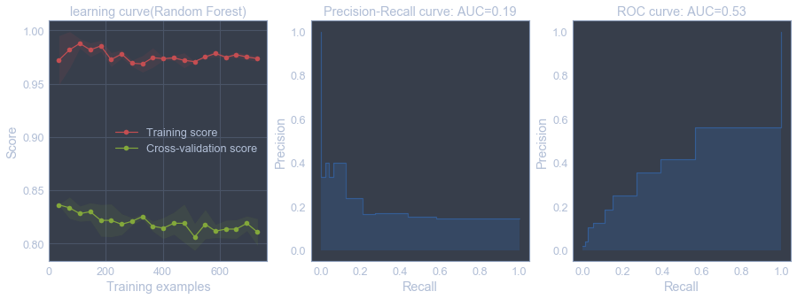

# sklearn应用之员工离职预测

本文的目的是利用DataCastle中的[员工离职训练赛](http://www.dcjingsai.com/common/cmpt/%E5%91%98%E5%B7%A5%E7%A6%BB%E8%81%8C%E9%A2%84%E6%B5%8B%E8%AE%AD%E7%BB%83%E8%B5%9B_%E7%AB%9E%E8%B5%9B%E4%BF%A1%E6%81%AF.html)，练习sklearn的应用，包括特征工程，模型训练和模型评估。旨在熟悉各种特征工程，指标，集成学习等API的使用，不考虑最终得分。


```python
#pandas, numpy, matplotlib, seaborn
import pandas as pd
import matplotlib.pyplot as plt
import seaborn as sns
sns.set_style('whitegrid')
try:
    from jupyterthemes import jtplot
    jtplot.style(theme='onedork')
except ModuleNotFoundError:
    pass
import numpy as np
import time
%pylab inline
```

    Populating the interactive namespace from numpy and matplotlib
    


```python
#sklearn API
from sklearn.linear_model import LogisticRegression
from sklearn.ensemble import RandomForestClassifier
from sklearn.metrics import accuracy_score
from sklearn.model_selection import cross_val_score
from sklearn.model_selection import cross_validate
from sklearn.metrics import classification_report
from sklearn.model_selection import train_test_split
from sklearn.metrics import confusion_matrix
from sklearn.preprocessing import LabelEncoder
from sklearn.preprocessing import StandardScaler
from sklearn.preprocessing import OneHotEncoder
from sklearn.model_selection import learning_curve
from sklearn.metrics import precision_recall_curve
from sklearn.metrics import average_precision_score
from sklearn.metrics import roc_curve
from sklearn.metrics import roc_auc_score
from sklearn.metrics import auc
from sklearn.model_selection import GridSearchCV
from sklearn.ensemble import BaggingClassifier
```


```python
df_train = pd.read_csv('pfm_train.csv')
df_test = pd.read_csv('pfm_test.csv')
```


```python
df_train.shape,df_test.shape
```


    ((1100, 31), (350, 30))


训练集有1100条数据，31个变量。测试集350条数据，30个变量，缺少的一个变量就是需要预测的员工离职状态。


```python
df_train.info()
print('=*60')
df_test.info()
```

    <class 'pandas.core.frame.DataFrame'>
    RangeIndex: 1100 entries, 0 to 1099
    Data columns (total 31 columns):
    Age                         1100 non-null int64
    Attrition                   1100 non-null int64
    BusinessTravel              1100 non-null object
    Department                  1100 non-null object
    DistanceFromHome            1100 non-null int64
    Education                   1100 non-null int64
    EducationField              1100 non-null object
    EmployeeNumber              1100 non-null int64
    EnvironmentSatisfaction     1100 non-null int64
    Gender                      1100 non-null object
    JobInvolvement              1100 non-null int64
    JobLevel                    1100 non-null int64
    JobRole                     1100 non-null object
    JobSatisfaction             1100 non-null int64
    MaritalStatus               1100 non-null object
    MonthlyIncome               1100 non-null int64
    NumCompaniesWorked          1100 non-null int64
    Over18                      1100 non-null object
    OverTime                    1100 non-null object
    PercentSalaryHike           1100 non-null int64
    PerformanceRating           1100 non-null int64
    RelationshipSatisfaction    1100 non-null int64
    StandardHours               1100 non-null int64
    StockOptionLevel            1100 non-null int64
    TotalWorkingYears           1100 non-null int64
    TrainingTimesLastYear       1100 non-null int64
    WorkLifeBalance             1100 non-null int64
    YearsAtCompany              1100 non-null int64
    YearsInCurrentRole          1100 non-null int64
    YearsSinceLastPromotion     1100 non-null int64
    YearsWithCurrManager        1100 non-null int64
    dtypes: int64(23), object(8)
    memory usage: 266.5+ KB
    =*60
    <class 'pandas.core.frame.DataFrame'>
    RangeIndex: 350 entries, 0 to 349
    Data columns (total 30 columns):
    Age                         350 non-null int64
    BusinessTravel              350 non-null object
    Department                  350 non-null object
    DistanceFromHome            350 non-null int64
    Education                   350 non-null int64
    EducationField              350 non-null object
    EmployeeNumber              350 non-null int64
    EnvironmentSatisfaction     350 non-null int64
    Gender                      350 non-null object
    JobInvolvement              350 non-null int64
    JobLevel                    350 non-null int64
    JobRole                     350 non-null object
    JobSatisfaction             350 non-null int64
    MaritalStatus               350 non-null object
    MonthlyIncome               350 non-null int64
    NumCompaniesWorked          350 non-null int64
    Over18                      350 non-null object
    OverTime                    350 non-null object
    PercentSalaryHike           350 non-null int64
    PerformanceRating           350 non-null int64
    RelationshipSatisfaction    350 non-null int64
    StandardHours               350 non-null int64
    StockOptionLevel            350 non-null int64
    TotalWorkingYears           350 non-null int64
    TrainingTimesLastYear       350 non-null int64
    WorkLifeBalance             350 non-null int64
    YearsAtCompany              350 non-null int64
    YearsInCurrentRole          350 non-null int64
    YearsSinceLastPromotion     350 non-null int64
    YearsWithCurrManager        350 non-null int64
    dtypes: int64(22), object(8)
    memory usage: 82.1+ KB
    

两个数据集都和完整，没有缺失值，有分类变量和数值变量。但从数据字典里分析得到，很多特征是序数，不能当作连续值看待。


```python
pd.DataFrame({'train': df_train.apply(lambda x: len(x.unique())).astype(int32),
              'test': df_test.apply(lambda x: len(x.unique()))})
```


<div>
<style>
    .dataframe thead tr:only-child th {
        text-align: right;
    }

    .dataframe thead th {
        text-align: left;
    }

    .dataframe tbody tr th {
        vertical-align: top;
    }
</style>
<table border="1" class="dataframe">
  <thead>
    <tr style="text-align: right;">
      <th></th>
      <th>test</th>
      <th>train</th>
    </tr>
  </thead>
  <tbody>
    <tr>
      <th>Age</th>
      <td>42.0</td>
      <td>43</td>
    </tr>
    <tr>
      <th>Attrition</th>
      <td>NaN</td>
      <td>2</td>
    </tr>
    <tr>
      <th>BusinessTravel</th>
      <td>3.0</td>
      <td>3</td>
    </tr>
    <tr>
      <th>Department</th>
      <td>3.0</td>
      <td>3</td>
    </tr>
    <tr>
      <th>DistanceFromHome</th>
      <td>29.0</td>
      <td>29</td>
    </tr>
    <tr>
      <th>Education</th>
      <td>5.0</td>
      <td>5</td>
    </tr>
    <tr>
      <th>EducationField</th>
      <td>6.0</td>
      <td>6</td>
    </tr>
    <tr>
      <th>EmployeeNumber</th>
      <td>350.0</td>
      <td>1100</td>
    </tr>
    <tr>
      <th>EnvironmentSatisfaction</th>
      <td>4.0</td>
      <td>4</td>
    </tr>
    <tr>
      <th>Gender</th>
      <td>2.0</td>
      <td>2</td>
    </tr>
    <tr>
      <th>JobInvolvement</th>
      <td>4.0</td>
      <td>4</td>
    </tr>
    <tr>
      <th>JobLevel</th>
      <td>5.0</td>
      <td>5</td>
    </tr>
    <tr>
      <th>JobRole</th>
      <td>9.0</td>
      <td>9</td>
    </tr>
    <tr>
      <th>JobSatisfaction</th>
      <td>4.0</td>
      <td>4</td>
    </tr>
    <tr>
      <th>MaritalStatus</th>
      <td>3.0</td>
      <td>3</td>
    </tr>
    <tr>
      <th>MonthlyIncome</th>
      <td>343.0</td>
      <td>1028</td>
    </tr>
    <tr>
      <th>NumCompaniesWorked</th>
      <td>10.0</td>
      <td>10</td>
    </tr>
    <tr>
      <th>Over18</th>
      <td>1.0</td>
      <td>1</td>
    </tr>
    <tr>
      <th>OverTime</th>
      <td>2.0</td>
      <td>2</td>
    </tr>
    <tr>
      <th>PercentSalaryHike</th>
      <td>15.0</td>
      <td>15</td>
    </tr>
    <tr>
      <th>PerformanceRating</th>
      <td>2.0</td>
      <td>2</td>
    </tr>
    <tr>
      <th>RelationshipSatisfaction</th>
      <td>4.0</td>
      <td>4</td>
    </tr>
    <tr>
      <th>StandardHours</th>
      <td>1.0</td>
      <td>1</td>
    </tr>
    <tr>
      <th>StockOptionLevel</th>
      <td>4.0</td>
      <td>4</td>
    </tr>
    <tr>
      <th>TotalWorkingYears</th>
      <td>35.0</td>
      <td>40</td>
    </tr>
    <tr>
      <th>TrainingTimesLastYear</th>
      <td>7.0</td>
      <td>7</td>
    </tr>
    <tr>
      <th>WorkLifeBalance</th>
      <td>4.0</td>
      <td>4</td>
    </tr>
    <tr>
      <th>YearsAtCompany</th>
      <td>27.0</td>
      <td>35</td>
    </tr>
    <tr>
      <th>YearsInCurrentRole</th>
      <td>17.0</td>
      <td>19</td>
    </tr>
    <tr>
      <th>YearsSinceLastPromotion</th>
      <td>14.0</td>
      <td>16</td>
    </tr>
    <tr>
      <th>YearsWithCurrManager</th>
      <td>15.0</td>
      <td>18</td>
    </tr>
  </tbody>
</table>
</div>


从各个特征的唯一值中可以看出，‘EmployeeNumber’是员工唯一的编号，‘Over18’表示所有的员工都超过了18岁，‘StandardHours’表示所有的员工标准工作时间都是相同的。这三个变量对分析没有意义，需要删除。但‘EmployeeNumber’作为员工唯一编号，对分析有好处，暂时保留。


```python
#删除Over18和StandarHours两个特征
df_train.drop(['Over18','StandardHours'],axis=1,inplace=True)
df_test.drop(['Over18','StandardHours'],axis=1,inplace=True)
```


```python
df_train.describe()
```


<div>
<style>
    .dataframe thead tr:only-child th {
        text-align: right;
    }

    .dataframe thead th {
        text-align: left;
    }

    .dataframe tbody tr th {
        vertical-align: top;
    }
</style>
<table border="1" class="dataframe">
  <thead>
    <tr style="text-align: right;">
      <th></th>
      <th>Age</th>
      <th>Attrition</th>
      <th>DistanceFromHome</th>
      <th>Education</th>
      <th>EmployeeNumber</th>
      <th>EnvironmentSatisfaction</th>
      <th>JobInvolvement</th>
      <th>JobLevel</th>
      <th>JobSatisfaction</th>
      <th>MonthlyIncome</th>
      <th>...</th>
      <th>PerformanceRating</th>
      <th>RelationshipSatisfaction</th>
      <th>StockOptionLevel</th>
      <th>TotalWorkingYears</th>
      <th>TrainingTimesLastYear</th>
      <th>WorkLifeBalance</th>
      <th>YearsAtCompany</th>
      <th>YearsInCurrentRole</th>
      <th>YearsSinceLastPromotion</th>
      <th>YearsWithCurrManager</th>
    </tr>
  </thead>
  <tbody>
    <tr>
      <th>count</th>
      <td>1100.000000</td>
      <td>1100.000000</td>
      <td>1100.000000</td>
      <td>1100.000000</td>
      <td>1100.000000</td>
      <td>1100.000000</td>
      <td>1100.000000</td>
      <td>1100.000000</td>
      <td>1100.000000</td>
      <td>1100.000000</td>
      <td>...</td>
      <td>1100.000000</td>
      <td>1100.000000</td>
      <td>1100.000000</td>
      <td>1100.000000</td>
      <td>1100.000000</td>
      <td>1100.000000</td>
      <td>1100.000000</td>
      <td>1100.000000</td>
      <td>1100.000000</td>
      <td>1100.000000</td>
    </tr>
    <tr>
      <th>mean</th>
      <td>36.999091</td>
      <td>0.161818</td>
      <td>9.427273</td>
      <td>2.922727</td>
      <td>1028.157273</td>
      <td>2.725455</td>
      <td>2.730909</td>
      <td>2.054545</td>
      <td>2.732727</td>
      <td>6483.620909</td>
      <td>...</td>
      <td>3.152727</td>
      <td>2.696364</td>
      <td>0.788182</td>
      <td>11.221818</td>
      <td>2.807273</td>
      <td>2.746364</td>
      <td>7.011818</td>
      <td>4.207273</td>
      <td>2.226364</td>
      <td>4.123636</td>
    </tr>
    <tr>
      <th>std</th>
      <td>9.037230</td>
      <td>0.368451</td>
      <td>8.196694</td>
      <td>1.022242</td>
      <td>598.915204</td>
      <td>1.098053</td>
      <td>0.706366</td>
      <td>1.107805</td>
      <td>1.109731</td>
      <td>4715.293419</td>
      <td>...</td>
      <td>0.359888</td>
      <td>1.095356</td>
      <td>0.843347</td>
      <td>7.825548</td>
      <td>1.291514</td>
      <td>0.701121</td>
      <td>6.223093</td>
      <td>3.618115</td>
      <td>3.313830</td>
      <td>3.597996</td>
    </tr>
    <tr>
      <th>min</th>
      <td>18.000000</td>
      <td>0.000000</td>
      <td>1.000000</td>
      <td>1.000000</td>
      <td>1.000000</td>
      <td>1.000000</td>
      <td>1.000000</td>
      <td>1.000000</td>
      <td>1.000000</td>
      <td>1009.000000</td>
      <td>...</td>
      <td>3.000000</td>
      <td>1.000000</td>
      <td>0.000000</td>
      <td>0.000000</td>
      <td>0.000000</td>
      <td>1.000000</td>
      <td>0.000000</td>
      <td>0.000000</td>
      <td>0.000000</td>
      <td>0.000000</td>
    </tr>
    <tr>
      <th>25%</th>
      <td>30.000000</td>
      <td>0.000000</td>
      <td>2.000000</td>
      <td>2.000000</td>
      <td>504.250000</td>
      <td>2.000000</td>
      <td>2.000000</td>
      <td>1.000000</td>
      <td>2.000000</td>
      <td>2924.500000</td>
      <td>...</td>
      <td>3.000000</td>
      <td>2.000000</td>
      <td>0.000000</td>
      <td>6.000000</td>
      <td>2.000000</td>
      <td>2.000000</td>
      <td>3.000000</td>
      <td>2.000000</td>
      <td>0.000000</td>
      <td>2.000000</td>
    </tr>
    <tr>
      <th>50%</th>
      <td>36.000000</td>
      <td>0.000000</td>
      <td>7.000000</td>
      <td>3.000000</td>
      <td>1026.500000</td>
      <td>3.000000</td>
      <td>3.000000</td>
      <td>2.000000</td>
      <td>3.000000</td>
      <td>4857.000000</td>
      <td>...</td>
      <td>3.000000</td>
      <td>3.000000</td>
      <td>1.000000</td>
      <td>10.000000</td>
      <td>3.000000</td>
      <td>3.000000</td>
      <td>5.000000</td>
      <td>3.000000</td>
      <td>1.000000</td>
      <td>3.000000</td>
    </tr>
    <tr>
      <th>75%</th>
      <td>43.000000</td>
      <td>0.000000</td>
      <td>15.000000</td>
      <td>4.000000</td>
      <td>1556.500000</td>
      <td>4.000000</td>
      <td>3.000000</td>
      <td>3.000000</td>
      <td>4.000000</td>
      <td>8354.500000</td>
      <td>...</td>
      <td>3.000000</td>
      <td>4.000000</td>
      <td>1.000000</td>
      <td>15.000000</td>
      <td>3.000000</td>
      <td>3.000000</td>
      <td>9.000000</td>
      <td>7.000000</td>
      <td>3.000000</td>
      <td>7.000000</td>
    </tr>
    <tr>
      <th>max</th>
      <td>60.000000</td>
      <td>1.000000</td>
      <td>29.000000</td>
      <td>5.000000</td>
      <td>2065.000000</td>
      <td>4.000000</td>
      <td>4.000000</td>
      <td>5.000000</td>
      <td>4.000000</td>
      <td>19999.000000</td>
      <td>...</td>
      <td>4.000000</td>
      <td>4.000000</td>
      <td>3.000000</td>
      <td>40.000000</td>
      <td>6.000000</td>
      <td>4.000000</td>
      <td>37.000000</td>
      <td>18.000000</td>
      <td>15.000000</td>
      <td>17.000000</td>
    </tr>
  </tbody>
</table>
<p>8 rows × 22 columns</p>
</div>


### 数值特征变量分布
* 平均年龄是37岁，最小18岁，满足‘Over18’都是1的情况；最大60岁，应该是到了退休年龄。Age是连续值；
* 全体样本的离职率是0.16；
* MonthlyIncome，最高是19999，这个特征应该是和工作时间，职位等级有关系；
* TotalWorkingYears，大部分(>75%)的员工工作超过15年，最高是40年；
* YearsAtCompany，样本覆盖刚进公司的员工和工作37年的老员工，超过75%的员工在当前公司不超过10年；
* YearsInCurrentRole，YearsSinceLastPromotion，YearsWithCurrManager

### 序数特性的变量
数据集已经进过处理，有些分类变量的属性是序数。包括：
* DistanceFromHome
* Education
* EnvironmentSatisfaction
* JobInvolvement
* JobLevel
* JobSatisfaction
* OverTime
* PerformanceRating
* RelationshipSatisfaction
* TrainingTimesLastYear
* WorkLifeBalance


```python
df_train.describe(include=['object'])
```


<div>
<style>
    .dataframe thead tr:only-child th {
        text-align: right;
    }

    .dataframe thead th {
        text-align: left;
    }

    .dataframe tbody tr th {
        vertical-align: top;
    }
</style>
<table border="1" class="dataframe">
  <thead>
    <tr style="text-align: right;">
      <th></th>
      <th>BusinessTravel</th>
      <th>Department</th>
      <th>EducationField</th>
      <th>Gender</th>
      <th>JobRole</th>
      <th>MaritalStatus</th>
      <th>OverTime</th>
    </tr>
  </thead>
  <tbody>
    <tr>
      <th>count</th>
      <td>1100</td>
      <td>1100</td>
      <td>1100</td>
      <td>1100</td>
      <td>1100</td>
      <td>1100</td>
      <td>1100</td>
    </tr>
    <tr>
      <th>unique</th>
      <td>3</td>
      <td>3</td>
      <td>6</td>
      <td>2</td>
      <td>9</td>
      <td>3</td>
      <td>2</td>
    </tr>
    <tr>
      <th>top</th>
      <td>Travel_Rarely</td>
      <td>Research &amp; Development</td>
      <td>Life Sciences</td>
      <td>Male</td>
      <td>Sales Executive</td>
      <td>Married</td>
      <td>No</td>
    </tr>
    <tr>
      <th>freq</th>
      <td>787</td>
      <td>727</td>
      <td>462</td>
      <td>653</td>
      <td>247</td>
      <td>500</td>
      <td>794</td>
    </tr>
  </tbody>
</table>
</div>


### 标称变量分布
* 超过70%的员工偶尔出差(freq 787/count 1100)
* 大多数员工来自研发部门
* 生命科学领域的员工最多
* 超过50%的样本是男性
* 销售职位的员工最多
* 近50%的员工是已婚
* 超过70%的员工不加班

## 变量选择
因为这次主要是练习sklearn，因此不做过多的特征分析。在DC竞赛中，最高得分是0.90285，最好排名是第三，因为提交次数多了，排在了第四。<br>
<br>
<br>
为便于练习，选择如下变量：
* 月收入和年龄。收入和年龄是两个不同的scale，需要进行归一化(StandardScaler)，将一些变化幅度较大的特征化到[-1,1]之内。
* 部门。部门是分类变量，不要转化为数值变量(LabelEncode)
* EnvironmentSatisfaction。环境满意度虽然是数值型，但是属于序数，需要创建哑变量。

## 变量预处理
### 连续变量处理


```python
#标准化，当变量特征化到[-1,1]
scaler = StandardScaler()
#拟合训练集的年龄
age_scale = scaler.fit(np.array(df_train['Age']).reshape(-1,1).astype(float64))
#转化训练集的年龄
df_train['Age_Scale'] = scaler.fit_transform(np.array(df_train['Age']).reshape(-1,1).astype(float64),
                                             age_scale)
#转化测试集的年龄
df_test['Age_Scale'] = scaler.fit_transform(np.array(df_test['Age']).reshape(-1,1).astype(float64),
                                            age_scale)

#对月收入进行同样的处理
income_scale = scaler.fit(np.array(df_train['MonthlyIncome']).reshape(-1,1).astype(float64))
df_train['Income_Scale'] = scaler\
                          .fit_transform(np.array(df_train['MonthlyIncome'])\
                                           .reshape(-1,1).astype(float64), income_scale)
df_test['Income_Scale'] = scaler\
                         .fit_transform(np.array(df_test['MonthlyIncome'])\
                                          .reshape(-1,1).astype(float64), income_scale)

df_train[['Age_Scale', 'Income_Scale']].head()
```


<div>
<style>
    .dataframe thead tr:only-child th {
        text-align: right;
    }

    .dataframe thead th {
        text-align: left;
    }

    .dataframe tbody tr th {
        vertical-align: top;
    }
</style>
<table border="1" class="dataframe">
  <thead>
    <tr style="text-align: right;">
      <th></th>
      <th>Age_Scale</th>
      <th>Income_Scale</th>
    </tr>
  </thead>
  <tbody>
    <tr>
      <th>0</th>
      <td>0.000101</td>
      <td>-0.104096</td>
    </tr>
    <tr>
      <th>1</th>
      <td>1.882064</td>
      <td>0.852589</td>
    </tr>
    <tr>
      <th>2</th>
      <td>-0.332010</td>
      <td>-0.086910</td>
    </tr>
    <tr>
      <th>3</th>
      <td>0.221508</td>
      <td>1.327855</td>
    </tr>
    <tr>
      <th>4</th>
      <td>-0.996233</td>
      <td>-0.824846</td>
    </tr>
  </tbody>
</table>
</div>


### 分类变量处理


```python
le = LabelEncoder()

df_train['Department_Encode'] = le.fit_transform(df_train['Department'])
df_test['Department_Encode'] = le.fit_transform(df_test['Department'])
```

### 创建哑变量
创建哑变量有两种方式
* 使用sklearn中的OneHotEncoder
* 使用pandas中的get_dummies()


```python
#使用OneHotEncoder创建哑变量
enc = OneHotEncoder()
enc_temp = enc.fit_transform(np.array(df_train['EnvironmentSatisfaction']).reshape(-1,1))\
              .toarray()
enc_temp[0:5,:]
```


    array([[ 1.,  0.,  0.,  0.],
           [ 0.,  0.,  0.,  1.],
           [ 1.,  0.,  0.,  0.],
           [ 0.,  0.,  0.,  1.],
           [ 1.,  0.,  0.,  0.]])


从上面的结果可以看出，使用OneHotEncoder,得到的结果是array格式的，这种格式没有特征名，而且分析中其他数据都是pandas数据格式，不方便分析。


```python
#使用get_dummies()
dummy = pd.get_dummies(df_train['EnvironmentSatisfaction'], prefix='EnvSat')
df_train = pd.concat([df_train, dummy], axis=1)
df_train.filter(regex='Env').head()
```


<div>
<style>
    .dataframe thead tr:only-child th {
        text-align: right;
    }

    .dataframe thead th {
        text-align: left;
    }

    .dataframe tbody tr th {
        vertical-align: top;
    }
</style>
<table border="1" class="dataframe">
  <thead>
    <tr style="text-align: right;">
      <th></th>
      <th>EnvironmentSatisfaction</th>
      <th>EnvSat_1</th>
      <th>EnvSat_2</th>
      <th>EnvSat_3</th>
      <th>EnvSat_4</th>
    </tr>
  </thead>
  <tbody>
    <tr>
      <th>0</th>
      <td>1</td>
      <td>1</td>
      <td>0</td>
      <td>0</td>
      <td>0</td>
    </tr>
    <tr>
      <th>1</th>
      <td>4</td>
      <td>0</td>
      <td>0</td>
      <td>0</td>
      <td>1</td>
    </tr>
    <tr>
      <th>2</th>
      <td>1</td>
      <td>1</td>
      <td>0</td>
      <td>0</td>
      <td>0</td>
    </tr>
    <tr>
      <th>3</th>
      <td>4</td>
      <td>0</td>
      <td>0</td>
      <td>0</td>
      <td>1</td>
    </tr>
    <tr>
      <th>4</th>
      <td>1</td>
      <td>1</td>
      <td>0</td>
      <td>0</td>
      <td>0</td>
    </tr>
  </tbody>
</table>
</div>


从上面的结果可以看出，用get_dummies()可以直接得到DataFrame，再用concat和数据集合并就可以。<br>
用OneHotEncoder得到的结果，需要转化为DataFrame，并且还要取名，如果特征很多，取名会相当麻烦。


```python
#对测试集做相同处理
dummy = pd.get_dummies(df_test['EnvironmentSatisfaction'], prefix='EnvSat')
df_test = pd.concat([df_test, dummy], axis=1)
```

### 对Department_Encode创建哑变量
上面虽然对Department做了数值化，但是它和EnvironmentSatisfaction一样，需要创建哑变量


```python
dummy = pd.get_dummies(df_train['Department_Encode'], prefix='DepEnc')
df_train = pd.concat([df_train, dummy], axis=1)

dummy = pd.get_dummies(df_test['Department_Encode'], prefix='DepEnc')
df_test = pd.concat([df_test, dummy], axis=1)
df_train.filter(regex='Dep').head()
```


<div>
<style>
    .dataframe thead tr:only-child th {
        text-align: right;
    }

    .dataframe thead th {
        text-align: left;
    }

    .dataframe tbody tr th {
        vertical-align: top;
    }
</style>
<table border="1" class="dataframe">
  <thead>
    <tr style="text-align: right;">
      <th></th>
      <th>Department</th>
      <th>Department_Encode</th>
      <th>DepEnc_0</th>
      <th>DepEnc_1</th>
      <th>DepEnc_2</th>
    </tr>
  </thead>
  <tbody>
    <tr>
      <th>0</th>
      <td>Research &amp; Development</td>
      <td>1</td>
      <td>0</td>
      <td>1</td>
      <td>0</td>
    </tr>
    <tr>
      <th>1</th>
      <td>Research &amp; Development</td>
      <td>1</td>
      <td>0</td>
      <td>1</td>
      <td>0</td>
    </tr>
    <tr>
      <th>2</th>
      <td>Research &amp; Development</td>
      <td>1</td>
      <td>0</td>
      <td>1</td>
      <td>0</td>
    </tr>
    <tr>
      <th>3</th>
      <td>Research &amp; Development</td>
      <td>1</td>
      <td>0</td>
      <td>1</td>
      <td>0</td>
    </tr>
    <tr>
      <th>4</th>
      <td>Research &amp; Development</td>
      <td>1</td>
      <td>0</td>
      <td>1</td>
      <td>0</td>
    </tr>
  </tbody>
</table>
</div>


根据需要，也可以直接对分类变量创建哑变量


```python
dummy = pd.get_dummies(df_train['Department'], prefix='Dep')
df_train = pd.concat([df_train, dummy], axis=1)

dummy = pd.get_dummies(df_test['Department'], prefix='Dep')
df_test = pd.concat([df_test, dummy], axis=1)

df_train.filter(regex='Dep').head()
```


<div>
<style>
    .dataframe thead tr:only-child th {
        text-align: right;
    }

    .dataframe thead th {
        text-align: left;
    }

    .dataframe tbody tr th {
        vertical-align: top;
    }
</style>
<table border="1" class="dataframe">
  <thead>
    <tr style="text-align: right;">
      <th></th>
      <th>Department</th>
      <th>Department_Encode</th>
      <th>DepEnc_0</th>
      <th>DepEnc_1</th>
      <th>DepEnc_2</th>
      <th>Dep_Human Resources</th>
      <th>Dep_Research &amp; Development</th>
      <th>Dep_Sales</th>
    </tr>
  </thead>
  <tbody>
    <tr>
      <th>0</th>
      <td>Research &amp; Development</td>
      <td>1</td>
      <td>0</td>
      <td>1</td>
      <td>0</td>
      <td>0</td>
      <td>1</td>
      <td>0</td>
    </tr>
    <tr>
      <th>1</th>
      <td>Research &amp; Development</td>
      <td>1</td>
      <td>0</td>
      <td>1</td>
      <td>0</td>
      <td>0</td>
      <td>1</td>
      <td>0</td>
    </tr>
    <tr>
      <th>2</th>
      <td>Research &amp; Development</td>
      <td>1</td>
      <td>0</td>
      <td>1</td>
      <td>0</td>
      <td>0</td>
      <td>1</td>
      <td>0</td>
    </tr>
    <tr>
      <th>3</th>
      <td>Research &amp; Development</td>
      <td>1</td>
      <td>0</td>
      <td>1</td>
      <td>0</td>
      <td>0</td>
      <td>1</td>
      <td>0</td>
    </tr>
    <tr>
      <th>4</th>
      <td>Research &amp; Development</td>
      <td>1</td>
      <td>0</td>
      <td>1</td>
      <td>0</td>
      <td>0</td>
      <td>1</td>
      <td>0</td>
    </tr>
  </tbody>
</table>
</div>


有的时候，直接对分类变量创建哑变量更方便，因为特征名是对应的特征值。当然，需要根据应用场景和分类器进行选择。


```python
df_train.filter(regex='Income|Age|Dep|Env').head()
```


<div>
<style>
    .dataframe thead tr:only-child th {
        text-align: right;
    }

    .dataframe thead th {
        text-align: left;
    }

    .dataframe tbody tr th {
        vertical-align: top;
    }
</style>
<table border="1" class="dataframe">
  <thead>
    <tr style="text-align: right;">
      <th></th>
      <th>Age</th>
      <th>Department</th>
      <th>EnvironmentSatisfaction</th>
      <th>MonthlyIncome</th>
      <th>Age_Scale</th>
      <th>Income_Scale</th>
      <th>Department_Encode</th>
      <th>EnvSat_1</th>
      <th>EnvSat_2</th>
      <th>EnvSat_3</th>
      <th>EnvSat_4</th>
      <th>DepEnc_0</th>
      <th>DepEnc_1</th>
      <th>DepEnc_2</th>
      <th>Dep_Human Resources</th>
      <th>Dep_Research &amp; Development</th>
      <th>Dep_Sales</th>
    </tr>
  </thead>
  <tbody>
    <tr>
      <th>0</th>
      <td>37</td>
      <td>Research &amp; Development</td>
      <td>1</td>
      <td>5993</td>
      <td>0.000101</td>
      <td>-0.104096</td>
      <td>1</td>
      <td>1</td>
      <td>0</td>
      <td>0</td>
      <td>0</td>
      <td>0</td>
      <td>1</td>
      <td>0</td>
      <td>0</td>
      <td>1</td>
      <td>0</td>
    </tr>
    <tr>
      <th>1</th>
      <td>54</td>
      <td>Research &amp; Development</td>
      <td>4</td>
      <td>10502</td>
      <td>1.882064</td>
      <td>0.852589</td>
      <td>1</td>
      <td>0</td>
      <td>0</td>
      <td>0</td>
      <td>1</td>
      <td>0</td>
      <td>1</td>
      <td>0</td>
      <td>0</td>
      <td>1</td>
      <td>0</td>
    </tr>
    <tr>
      <th>2</th>
      <td>34</td>
      <td>Research &amp; Development</td>
      <td>1</td>
      <td>6074</td>
      <td>-0.332010</td>
      <td>-0.086910</td>
      <td>1</td>
      <td>1</td>
      <td>0</td>
      <td>0</td>
      <td>0</td>
      <td>0</td>
      <td>1</td>
      <td>0</td>
      <td>0</td>
      <td>1</td>
      <td>0</td>
    </tr>
    <tr>
      <th>3</th>
      <td>39</td>
      <td>Research &amp; Development</td>
      <td>4</td>
      <td>12742</td>
      <td>0.221508</td>
      <td>1.327855</td>
      <td>1</td>
      <td>0</td>
      <td>0</td>
      <td>0</td>
      <td>1</td>
      <td>0</td>
      <td>1</td>
      <td>0</td>
      <td>0</td>
      <td>1</td>
      <td>0</td>
    </tr>
    <tr>
      <th>4</th>
      <td>28</td>
      <td>Research &amp; Development</td>
      <td>1</td>
      <td>2596</td>
      <td>-0.996233</td>
      <td>-0.824846</td>
      <td>1</td>
      <td>1</td>
      <td>0</td>
      <td>0</td>
      <td>0</td>
      <td>0</td>
      <td>1</td>
      <td>0</td>
      <td>0</td>
      <td>1</td>
      <td>0</td>
    </tr>
  </tbody>
</table>
</div>


```python
df_test.filter(regex='Income|Age|Dep|Env').head()
```


<div>
<style>
    .dataframe thead tr:only-child th {
        text-align: right;
    }

    .dataframe thead th {
        text-align: left;
    }

    .dataframe tbody tr th {
        vertical-align: top;
    }
</style>
<table border="1" class="dataframe">
  <thead>
    <tr style="text-align: right;">
      <th></th>
      <th>Age</th>
      <th>Department</th>
      <th>EnvironmentSatisfaction</th>
      <th>MonthlyIncome</th>
      <th>Age_Scale</th>
      <th>Income_Scale</th>
      <th>Department_Encode</th>
      <th>EnvSat_1</th>
      <th>EnvSat_2</th>
      <th>EnvSat_3</th>
      <th>EnvSat_4</th>
      <th>DepEnc_0</th>
      <th>DepEnc_1</th>
      <th>DepEnc_2</th>
      <th>Dep_Human Resources</th>
      <th>Dep_Research &amp; Development</th>
      <th>Dep_Sales</th>
    </tr>
  </thead>
  <tbody>
    <tr>
      <th>0</th>
      <td>40</td>
      <td>Research &amp; Development</td>
      <td>3</td>
      <td>3975</td>
      <td>0.376985</td>
      <td>-0.541279</td>
      <td>1</td>
      <td>0</td>
      <td>0</td>
      <td>1</td>
      <td>0</td>
      <td>0</td>
      <td>1</td>
      <td>0</td>
      <td>0</td>
      <td>1</td>
      <td>0</td>
    </tr>
    <tr>
      <th>1</th>
      <td>53</td>
      <td>Research &amp; Development</td>
      <td>4</td>
      <td>18606</td>
      <td>1.765877</td>
      <td>2.620823</td>
      <td>1</td>
      <td>0</td>
      <td>0</td>
      <td>0</td>
      <td>1</td>
      <td>0</td>
      <td>1</td>
      <td>0</td>
      <td>0</td>
      <td>1</td>
      <td>0</td>
    </tr>
    <tr>
      <th>2</th>
      <td>42</td>
      <td>Research &amp; Development</td>
      <td>1</td>
      <td>6781</td>
      <td>0.590661</td>
      <td>0.065163</td>
      <td>1</td>
      <td>1</td>
      <td>0</td>
      <td>0</td>
      <td>0</td>
      <td>0</td>
      <td>1</td>
      <td>0</td>
      <td>0</td>
      <td>1</td>
      <td>0</td>
    </tr>
    <tr>
      <th>3</th>
      <td>34</td>
      <td>Human Resources</td>
      <td>3</td>
      <td>4490</td>
      <td>-0.264042</td>
      <td>-0.429976</td>
      <td>0</td>
      <td>0</td>
      <td>0</td>
      <td>1</td>
      <td>0</td>
      <td>1</td>
      <td>0</td>
      <td>0</td>
      <td>1</td>
      <td>0</td>
      <td>0</td>
    </tr>
    <tr>
      <th>4</th>
      <td>32</td>
      <td>Research &amp; Development</td>
      <td>4</td>
      <td>2956</td>
      <td>-0.477718</td>
      <td>-0.761509</td>
      <td>1</td>
      <td>0</td>
      <td>0</td>
      <td>0</td>
      <td>1</td>
      <td>0</td>
      <td>1</td>
      <td>0</td>
      <td>0</td>
      <td>1</td>
      <td>0</td>
    </tr>
  </tbody>
</table>
</div>


```python
#提取用于训练模型的特征
X = df_train.filter(regex='_Scale|Environment|_Encode')
Y = df_train['Attrition']
```


```python
#定义交叉验证函数
def classification_func(model, X, Y, CV=5, method=1, scoring=None):
    '''
    参数解释:
    ====================
    model: 分类器
    X: 输入的feature
    Y: 输入的target
    CV: 交叉验证次数
    method: 交叉验证的方法
            1：cross_val_score,默认
            2：cross_validate
    scoring: 评估方式,准确率/精度/召回率/F1
    '''
    #用cross_validate
    #cross_validate和cross_val_score的区别是
    #1. 可以定义多个指标
    #2. 返回一个dict
    
    if method == 'cross_validate':
        score = cross_validate(model,X,Y,scoring=scoring, cv=CV)
        print('='*60)
        for x in score.keys():
            print('the %s is %.4f'%(x,score[x].mean()))
            print('='*60)
        
    #默认用cross_val_score
    else:
        #判断是否为list
        if isinstance(scoring, list):
            print('='*60)
            for x in range(len(scoring)):
                score = cross_val_score(model, X, Y, scoring=scoring[x], cv=CV)
                print('the %s score is %.4f(+/-%.4f)'%(scoring[x], score.mean(), score.std()*2))
                print('='*60)
        #判断是否为字符串
        elif isinstance(scoring, str):
            score = cross_val_score(model, X, Y, scoring=scoring, cv=CV)
            print('the %s score is %.4f(+/-%.4f)'%(scoring, score.mean(), score.std()*2))
        #默认用准确度评估
        else:
            score = cross_val_score(model, X, Y, scoring=scoring, cv=CV)
            print('the accuracy is %.4f(+/-%.4f)'%(score.mean(),score.std()*2))
```


```python
def plot_learning_curve(estimator, title, X, y, ylim=None, cv=None, n_jobs=1, 
                        train_sizes=np.linspace(.05, 1., 20), verbose=0, ax=None):
    """
    画出data在某模型上的learning curve.
    参数解释
    ----------
    estimator : 你用的分类器。
    title : 表格的标题。
    X : 输入的feature，numpy类型
    y : 输入的target vector
    ylim : tuple格式的(ymin, ymax), 设定图像中纵坐标的最低点和最高点
    cv : 做cross-validation的时候，数据分成的份数，其中一份作为cv集，其余n-1份作为training(默认为3份)
    n_jobs : 并行的的任务数(默认1)
    """
    train_sizes, train_scores, test_scores = learning_curve(
        estimator, X, y, cv=cv, n_jobs=n_jobs, train_sizes=train_sizes)
    train_scores_mean = np.mean(train_scores, axis=1)
    train_scores_std = np.std(train_scores, axis=1)
    test_scores_mean = np.mean(test_scores, axis=1)
    test_scores_std = np.std(test_scores, axis=1)
    
    if ax == None:
        plt.figure(figsize=(15,7))
        plt.title(title)
        if ylim is not None:
            plt.ylim(*ylim)
        plt.xlabel("Training examples")
        plt.ylabel("Score")
        plt.fill_between(train_sizes, train_scores_mean - train_scores_std,
                         train_scores_mean + train_scores_std, alpha=0.1,
                         color="r")
        plt.fill_between(train_sizes, test_scores_mean - test_scores_std,
                         test_scores_mean + test_scores_std, alpha=0.1, color="g")
        plt.plot(train_sizes, train_scores_mean, 'o-', color="r",
                 label="Training score")
        plt.plot(train_sizes, test_scores_mean, 'o-', color="g",
                 label="Cross-validation score")

        plt.legend(loc="best")
    else:
        ax.set_title(title)
        if ylim is not None:
            ax.set_ylim(*ylim)
        ax.set_xlabel("Training examples")
        ax.set_ylabel("Score")
        ax.fill_between(train_sizes, train_scores_mean - train_scores_std,
                         train_scores_mean + train_scores_std, alpha=0.1,
                         color="r")
        ax.fill_between(train_sizes, test_scores_mean - test_scores_std,
                         test_scores_mean + test_scores_std, alpha=0.1, color="g")
        ax.plot(train_sizes, train_scores_mean, 'o-', color="r",
                 label="Training score")
        ax.plot(train_sizes, test_scores_mean, 'o-', color="g",
                 label="Cross-validation score")

        ax.legend(loc="best")

    midpoint = ((train_scores_mean[-1] + train_scores_std[-1]) + (test_scores_mean[-1] - test_scores_std[-1])) / 2
    diff = (train_scores_mean[-1] + train_scores_std[-1]) - (test_scores_mean[-1] - test_scores_std[-1])
    return midpoint, diff
```


```python
def plot_pr_curve(estimator, X, y,test_size=0.3, ax=None):
    """
    画出data在某模型上的P-R曲线.
    参数解释
    ----------
    estimator : 你用的分类器。
    X : 输入的feature，numpy类型
    y : 输入的target vector
    """
    X_train, X_test, Y_train, Y_test = train_test_split(X, Y,
                                                        test_size=test_size,
                                                        random_state=0)
    estimator.fit(X_train, Y_train)
    if hasattr(estimator, 'decision_function'):
        y_score = estimator.decision_function(X_test)
    else:
        y_score = estimator.predict_proba(X_test)[:,1]
    average_precision = average_precision_score(Y_test, y_score)
    precision, recall, threshold = precision_recall_curve(Y_test, y_score)    
    
    if ax == None:
        plt.figure(figsize=(15,7))
        plt.xlabel("Recall")
        plt.ylabel("Precision")
        plt.grid()
    
        plt.step(recall, precision, color='b', alpha=0.5, where='post')
        plt.fill_between(recall, precision, step='post', alpha=0.2, color='b')
        plt.title('Precision-Recall curve: AUC={0:0.2f}'.format(average_precision))
    else:
        ax.set_xlabel("Recall")
        ax.set_ylabel("Precision")
        ax.grid()
    
        ax.step(recall, precision, color='b', alpha=0.5, where='post')
        ax.fill_between(recall, precision, step='post', alpha=0.2, color='b')
        ax.set_title('Precision-Recall curve: AUC={0:0.2f}'.format(average_precision))
    
    return
```


```python
def plot_roc_curve(estimator, X, y, test_size=0.3, ax=None):
    """
    画出data在某模型上的ROC曲线.
    参数解释
    ----------
    estimator : 你用的分类器。
    X : 输入的feature，numpy类型
    y : 输入的target vector
    ylim : tuple格式的(ymin, ymax), 设定图像中纵坐标的最低点和最高点
    cv : 做cross-validation的时候，数据分成的份数，其中一份作为cv集，其余n-1份作为training(默认为3份)
    n_jobs : 并行的的任务数(默认1)
    """
    
    X_train, X_test, Y_train, Y_test = train_test_split(X, Y,
                                                        test_size=test_size,
                                                        random_state=0)
    estimator.fit(X_train, Y_train)
    if hasattr(estimator, 'decision_function'):
        y_score = estimator.decision_function(X_test)
    else:
        y_score = estimator.predict_proba(X_test)[:,1]
    roc_score = roc_auc_score(Y_test, y_score)
    fpr, tpr, threshold = roc_curve(Y_test, y_score)
    #roc_score = auc(fpr, tpr)
    
    if ax == None:
        plt.figure(figsize=(15,7))
        plt.xlabel("Recall")
        plt.ylabel("Precision")
        plt.grid()
    
        plt.step(fpr, tpr, color='b', alpha=0.5, where='post')
        plt.fill_between(fpr, tpr, step='post', alpha=0.2, color='b')
        #plt.ylim([0.0, 1.05])
        #plt.xlim([0.0, 1.0])
        plt.title('ROC curve: AUC={0:0.2f}'.format(roc_score))
    else:
        ax.set_xlabel("Recall")
        ax.set_ylabel("Precision")
        ax.grid()
    
        ax.step(fpr, tpr, color='b', alpha=0.5, where='post')
        ax.fill_between(fpr, tpr, step='post', alpha=0.2, color='b')
        #plt.ylim([0.0, 1.05])
        #plt.xlim([0.0, 1.0])
        ax.set_title('ROC curve: AUC={0:0.2f}'.format(roc_score))
    
    return
```


```python
classifiers = {'Logistic Regression': LogisticRegression(),
               'Random Forest': RandomForestClassifier()}
for label, clf in classifiers.items():
    print('\nthe result of %s'%label)
    classification_func(clf,X,Y)
```

    
    the result of Logistic Regression
    the accuracy is 0.8382(+/-0.0033)
    
    the result of Random Forest
    the accuracy is 0.8164(+/-0.0377)
    


```python
#分别绘制学习曲线，PR曲线和ROC曲线
fig, ax = plt.subplots(1,3,figsize=(15,5))
plot_learning_curve(clf,'learning curve(Random Forest)', X,Y,ax=ax[0])
plot_pr_curve(clf, X,Y,ax=ax[1])
plot_roc_curve(clf, X,Y,ax=ax[2])
```




